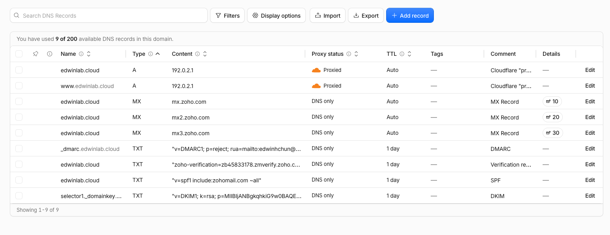
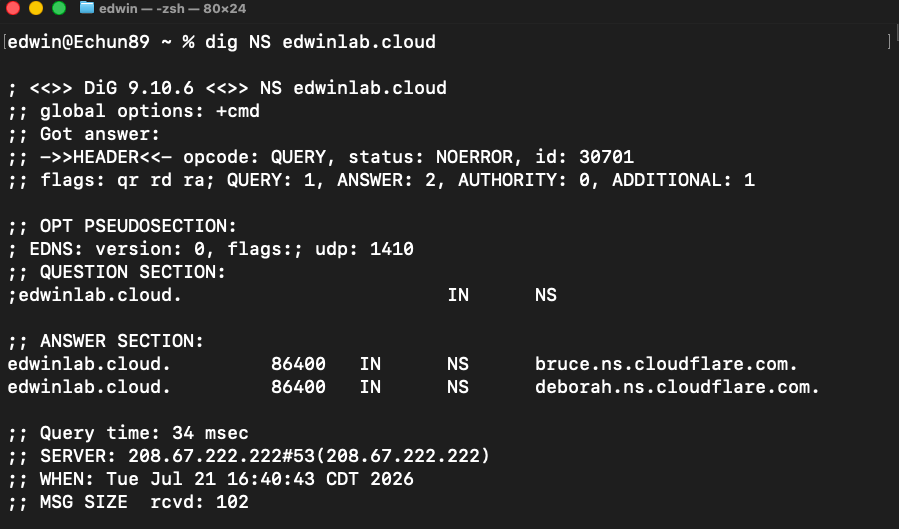
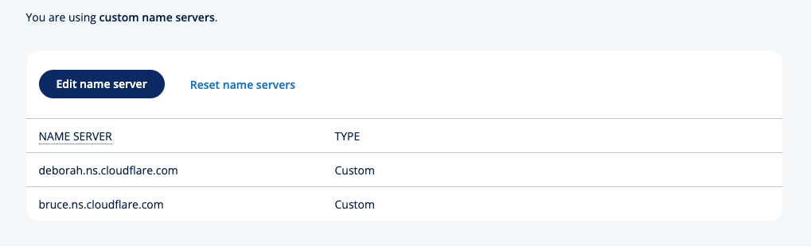
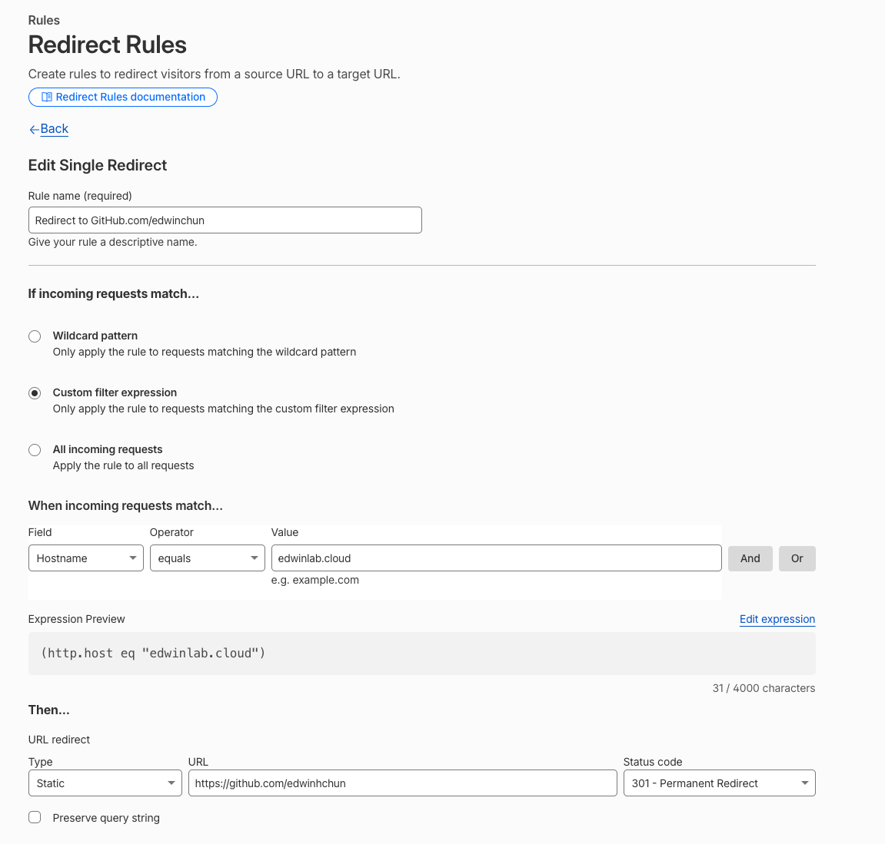
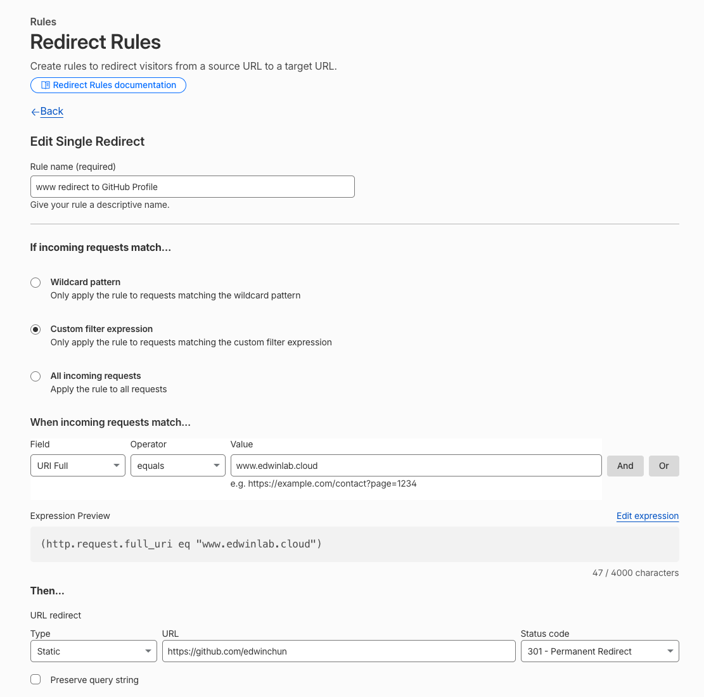
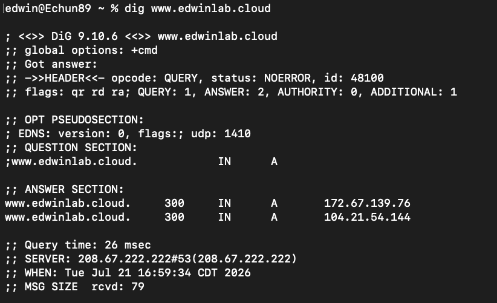
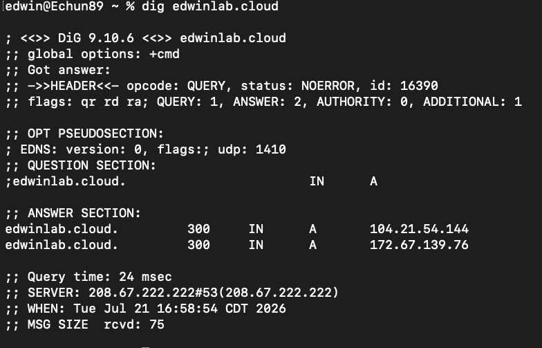
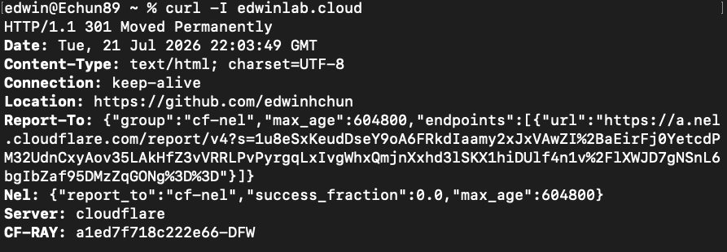

# Cloudflare-DNS-and-HTTP-Redirect-Lab
Migrating Authoritative DNS from INOS over to Cloudflare, with Zoho Mail, and troubleshooting a Cloudflare edge redirect

**My domain:** `edwinlab.cloud`  
**Redirect destination:** `https://github.com/edwinhchun`

## Overview

This project documents a DNS migration and HTTP redirect implementation. I purchased `edwinlab.cloud` through IONOS, configured Zoho Mail as my mail server, migrated the domain's authoritative DNS to Cloudflare, preserved the email-related DNS records, and created a Cloudflare Redirect Rule that sends visitors to my GitHub profile.

The lab also includes two real troubleshooting scenarios:

- A bad redirect target that created a repeating URL path.
- A macOS DNS resolver-cache issue where `dig` worked while `curl` and `ping` could not resolve the hostname.

## Architecture

```text
User enters https://edwinlab.cloud or https://www.edwinlab.cloud
                |
                v
Cloudflare authoritative DNS resolves the hostname
                |
                v
Cloudflare's reverse proxy receives the HTTPS request
                |
                v
Cloudflare Redirect Rule returns HTTP 301
                |
                v
Browser requests https://github.com/edwinhchun
```

## Implementation

### 1. Purchase the Domain through IONOS

I bought `edwinlab.cloud` through IONOS. At this point, IONOS acted as both the registrar and the authoritative DNS provider.

#### Screenshot: IONOS domain overview


### 2. Configure Zoho Mail

I configured Zoho Mail before migrating DNS. The email setup required several DNS TXT records to be moved over to IONOS:

- **MX records** route inbound email to Zoho Mail servers
- **SPF TXT record** identifies systems authorized to send mail for the domain
- **DKIM TXT record** allows receiving systems to verify Zoho's crypto signature
- **Verification record** proves ownership of the domain to Zoho

### 3. Add the Domain to Cloudflare

I added the DNS records manually to Cloudflare. 

#### Screenshot: Imported DNS records in Cloudflare



### 4. Delegate Authoritative DNS to Cloudflare

Cloudflare assigned two authoritative nameservers. I entered those nameservers in the IONOS domain settings. After the change propagated, Cloudflare reported the zone as **Active** and began answering authoritative DNS queries for `edwinlab.cloud`.

Verification command:

```bash
dig NS edwinlab.cloud
```

#### Screenshot: Cloudflare nameserver confirmation in terminal



#### Screenshot: Cloudflare nameserver delegation



### 5. Verify Zoho Mail Records after Migration

After Cloudflare became authoritative, I checked the Zoho records again and verified that email still worked. This confirmed that the email provider could remain Zoho while DNS authority moved to Cloudflare.

### 6. Create a Proxied Apex Record

I created proxied A records for both the apex and the Fully Qualified Domain Name (FQDN) hostnames. Cloudflare represents the apex domain with `@`.

| Type | Name | IPv4 address | Proxy status |
|---|---|---|---|
| A | `@` | `192.0.2.1` | Proxied — orange cloud |
| A | `www` | `192.0.2.1` | Proxied - orange cloud |

`192.0.2.1` belongs to a range reserved for documentation and testing. In this lab, the origin was not expected to serve content. Because the record was proxied, Cloudflare received the request and returned the redirect before contacting the placeholder origin.

#### Screenshot: Proxied apex A record


### 7. Create the HTTP Redirect Rule

I created a Cloudflare Redirect Rule with the following configurations:

## For the apex domain
```text
Incoming request condition:
(http.host eq "edwinlab.cloud")

Action:
Static redirect

Destination URL:
https://github.com/edwinhchun

Status code:
301 - Permanent Redirect
```

#### Screenshot: Cloudflare Redirect Rule



## For the Fully Qualified Domain Name
```text
Incoming request condition:
(http.host eq "edwinlab.cloud")

Action:
Static redirect

Destination URL:
https://github.com/edwinhchun

Status code:
301 - Permanent Redirect
```

#### Screenshot: Cloudflare Redirect Rule



## Verification

### Browser Test

Opening `https://edwinlab.cloud` redirected the browser to my GitHub profile. This confirmed the complete user-facing path from DNS resolution to the Cloudflare edge redirect.

### DNS Verification with `dig`

I used `dig` to verify that the hostname resolved and that the domain was delegated to Cloudflare nameservers.

```bash
# Complete DNS response
dig edwinlab.cloud

# Only returned IP addresses
dig +short edwinlab.cloud

# Authoritative nameservers
dig NS edwinlab.cloud

# Query Cloudflare's public resolver directly
dig @1.1.1.1 edwinlab.cloud
```

#### Screenshot: `dig` results






### HTTP Verification with `curl`

I used `curl` to inspect the HTTP behavior independently of the browser.

```bash
# Show response headers only
curl -I https://edwinlab.cloud

# Follow the redirect
curl -L https://edwinlab.cloud

# Display verbose DNS, connection, TLS, request, and response details
curl -v https://edwinlab.cloud

# Show headers while following the complete redirect chain
curl -IL https://edwinlab.cloud
```

| Flag | Meaning | Useful evidence |
|---|---|---|
| `-I` | Sends a HEAD request and displays response headers | HTTP status and `Location` header |
| `-L` | Follows redirect responses automatically | Final destination and response |
| `-v` | Displays connection, TLS, request, and response details | The layer at which a request fails |
| `-IL` | Displays headers while following the redirect chain | Initial `301` followed by the destination response |

Expected redirect evidence:

```http
HTTP/2 301
Location: https://github.com/edwinhchun
Server: Cloudflare
```

#### Screenshot: Successful `curl` response




## Troubleshooting and Root-Cause Analysis

### Issue 1: Attempting to Use a CNAME for a URL Path

My first approach attempted to point a CNAME at `github.com/edwinhchun`.

A CNAME can point to a hostname:

```text
github.com
```

A CNAME cannot point to a complete URL or URL path:

```text
https://github.com/edwinhchun
github.com/edwinhchun
```

DNS does not understand the `https://` scheme or the `/edwinhchun` path.

**Resolution:** I used DNS to make `edwinlab.cloud` reach Cloudflare, then used an HTTP Redirect Rule to send the browser to the complete GitHub URL.

### Issue 2: Redirect Target Interpreted as a Relative Path

The redirect initially produced a rapidly expanding URL similar to:

```text
https://edwinlab.cloud/github.com/github.com/github.com/...
```

The destination had been entered without a complete URL scheme. Cloudflare interpreted it as a relative path on `edwinlab.cloud`. Because the rule continued to match the same hostname, each request appended another copy of the path.

**Resolution:** I changed the destination to the fully qualified URL:

```text
https://github.com/edwinhchun
```

Including `https://` tells Cloudflare that `github.com` is a separate hostname rather than a path on the current domain.

### Issue 3: `dig` Worked while `curl` and `ping` Failed

During terminal testing, `dig` returned valid DNS answers, but `ping` and `curl` reported that the hostname could not be resolved.

```text
ping: cannot resolve edwinlab.cloud: Unknown host
curl: (6) Could not resolve host: edwinlab.cloud
```

This happened because `dig` performs a direct DNS query, while `ping` and `curl` normally use the macOS system resolver. The browser could also continue working because it had a cached result or used a different resolver path.

I flushed the macOS DNS cache and restarted the resolver service:

```bash
sudo dscacheutil -flushcache
sudo killall -HUP mDNSResponder
```

Afterward, `ping` and `curl` successfully resolved the hostname.

## What Each Test Proved

| Test | Primary question | What success proved |
|---|---|---|
| `dig` | Does DNS publish an answer for this hostname? | The authoritative DNS zone and record were available |
| `dig NS` | Which nameservers are authoritative? | IONOS delegated DNS to Cloudflare |
| `ping` | Can the OS resolve the hostname, and does the target answer ICMP? | System name resolution worked; lack of an ICMP reply alone would not prove the website was down |
| `curl -I` | What status and headers does the HTTPS endpoint return? | Cloudflare returned the intended redirect and `Location` header |
| `curl -L` | Where does the redirect chain end? | The client reached the GitHub destination |
| `curl -v` | Where in DNS, TCP, TLS, or HTTP does the request fail? | The detailed connection sequence could be inspected |
| Browser | Does the complete user experience work? | A normal client could resolve, connect, receive the redirect, and load the destination |
